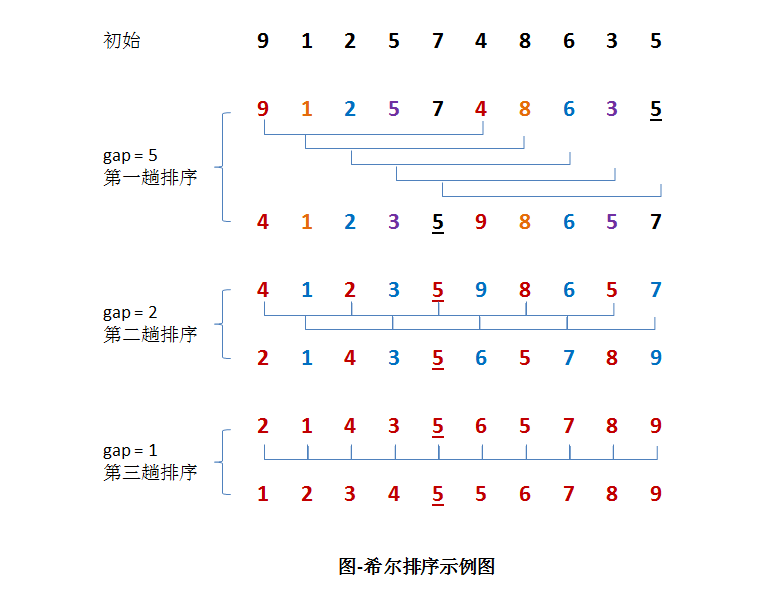

----------

#### 希尔排序（Shell Sort）
希尔排序的实质就是分组插入排序，该方法又称递减增量排序算法，因DL．Shell于1959年提出而得名。希尔排序是非稳定的排序算法。

在上一篇《[算法：排序算法之插入排序](https://github.com/7-sevens/algorithm/blob/master/sort/Insert_Sort.md)》中优化方案中就有提到过使用希尔排序进行改进。希尔排序是基于插入排序的以下两点性质而提出改进方法的：

> 插入排序在对几乎已经排好序的数据操作时，效率高，即可以达到线性排序的效率但插入排序一般来说是低效的，因为插入排序每次只能将数据移动一位

##### 1. 基本思想
先将整个待排元素序列分割成若干个子序列（由相隔某个“增量”的元素组成的）分别进行直接插入排序，然后依次缩减增量再进行排序，待整个序列中的元素基本有序（增量足够小）时，再对全体元素进行一次直接插入排序。

因为直接插入排序在元素基本有序的情况下（接近最好情况），效率是很高的，因此希尔排序在时间效率上比前两种方法有较大提高。

##### 2. 实现逻辑

> - 先取一个小于n的整数d1作为第一个增量，把文件的全部记录分成d1个组。
> - 所有距离为d1的倍数的记录放在同一个组中，在各组内进行直接插入排序。
> - 取第二个增量d2小于d1重复上述的分组和排序，直至所取的增量dt=1(dt小于dt-l小于…小于d2小于d1)，即所有记录放在同一组中进行直接插入排序为止。

##### 3. 动图演示


具体我们以一组数字来说操作说明：


假设有一组｛9, 1, 2, 5, 7, 4, 8, 6, 3, 5｝无需序列。

> **第一趟排序**：
> 设 gap1 = N / 2 = 5，即相隔距离为 5 的元素组成一组，可以分为 5 组。接下来，按照直接插入排序的方法对每个组进行排序。
>
> **第二趟排序**：
>
> 将上次的 gap 缩小一半，即 gap2 = gap1 / 2 = 2 (取整数)。这样每相隔距离为 2 的元素组成一组，可以分为2组。按照直接插入排序的方法对每个组进行排序。
>
> **第三趟排序**：
>
> 再次把 gap 缩小一半，即gap3 = gap2 / 2 = 1。 这样相隔距离为1的元素组成一组，即只有一组。按照直接插入排序的方法对每个组进行排序。此时，排序已经结束。

*注：需要注意一下的是，图中有两个相等数值的元素5和5。我们可以清楚的看到，在排序过程中，两个元素位置交换了。*

##### 4. 性能分析
- 平均时间复杂度：O(Nlog2N)
- 最佳时间复杂度：
- 最差时间复杂度：O(N^2)
- 空间复杂度：O(1)
- 稳定性：不稳定
- 复杂性：较复杂

希尔排序的效率取决于增量值gap的选取，时间复杂度并不是一个定值。

开始时，gap取值较大，子序列中的元素较少，排序速度快，克服了直接插入排序的缺点；其次，gap值逐渐变小后，虽然子序列的元素逐渐变多，但大多元素已基本有序，所以继承了直接插入排序的优点，能以近线性的速度排好序。

最优的空间复杂度为开始元素已排序，则空间复杂度为 0；最差的空间复杂度为开始元素为逆排序，则空间复杂度为 O(N);平均的空间复杂度为O(1)希尔排序并不只是相邻元素的比较，有许多跳跃式的比较，难免会出现相同元素之间的相对位置发生变化。比如上面的例子中希尔排序中相等数据5就交换了位置，所以希尔排序是不稳定的算法。

##### 5. 代码实现
**C版本**：

```
// C实现
void shell_sort(int arr[], int len) {
	int gap, i, j;
	int temp;
	for (gap = len >> 1; gap > 0; gap >>= 1)
		for (i = gap; i < len; i++) {
			temp = arr[i];
			for (j = i - gap; j >= 0 && arr[j] > temp; j -= gap)
				arr[j + gap] = arr[j];
			arr[j + gap] = temp;
		}
}
```

**C++版本**：

```
// C++实现
// 可以使用整数或浮点数作为元素，如果使用类(class)作为元素则需要重载大于(>)运算符。
template<typename T>
void shell_sort(T arr[], int len) {
	int gap, i, j;
	T temp;
	for (gap = len >> 1; gap > 0; gap >>= 1)
		for (i = gap; i < len; i++) {
			temp = arr[i];
			for (j = i - gap; j >= 0 && arr[j] > temp; j -= gap)
				arr[j + gap] = arr[j];
			arr[j + gap] = temp;
		}
}
```

**Java版本：**

```
// Java实现
public static void shell_sort(int[] arr) {
	int gap = 1, i, j, len = arr.length;
	int temp;
	while (gap < len / 3)
		gap = gap * 3 + 1;
	for (; gap > 0; gap /= 3)
		for (i = gap; i < len; i++) {
			temp = arr[i];
			for (j = i - gap; j >= 0 && arr[j] > temp; j -= gap)
				arr[j + gap] = arr[j];
			arr[j + gap] = temp;
		}
}
```

##### 6. 重点说明(步( 摘录自wiki百科)
**(6.1) 步长序列**
步长的选择是希尔排序的重要部分。只要最终步长为1任何步长序列都可以工作。算法最开始以一定的步长进行排序。然后会继续以一定步长进行排序，最终算法以步长为1进行排序。当步长为1时，算法变为插入排序，这就保证了数据一定会被排序。

作者最初的建议是折半再折半知道最后的步长为1<也就是插入排序>,虽然这样取可以比O(n2)类的算法（插入排序）更好，但这样仍然有减少平均时间和最差时间的余地。可能希尔排序最重要的地方在于当用较小步长排序后，以前用的较大步长仍然是有序的。比如, 如果一个数列以步长5进行了排序然后再以步长3进行排序，那么该数列不仅是以步长3有序，而且是以步长5有序。如果不是这样，那么算法在迭代过程中会打乱以前的顺序，那就不会以如此短的时间完成排序了。

**(6.2) 常见步长序列**

> ①步长序列：n/2i
> 最坏情况复杂度：O(n2)
>
> ②步长序列：2k-1
> 最坏情况复杂度：O(n3/2)
>
> ③步长序列：2i3j
> 最坏情况复杂度：O(nlog2n)

*注意：由于显示特殊符号存在问题，步长序列中i、k-1，j等都是右上标符号。*

已知的最好步长序列是由Sedgewick提出的(1, 5, 19, 41, 109,…)，该序列的项来自9 x 4i – 9 x 2i + 1 和 2i+2 x (2i+2 -3)这两个算式。(注意：公众号里面无法显示特殊符号，两个公式中i，j等都是右上标符号)

----------

#### 总结
希尔排序通过将比较的全部元素分为几个区域来提升插入排序的性能，交换不相邻的元素以对数组的局部进行排序，最终用插入排序将局部有序的数组排序。

希尔排序时效分析很难，关键码的比较次数与记录移动次数依赖于增量因子序列d的选取，特定情况下可以准确估算出关键码的比较次数和记录的移动次数。目前还没有人给出选取最好的增量因子序列的方法。增量因子序列可以有各种取法，有取奇数的，也有取质数的，但需要注意：增量因子中除1外没有公因子，且最后一个增量因子必须为1。希尔排序方法是一个不稳定的排序方法。

---
---
**PS**: 更多资源，欢迎关注微信公众号：developer1024


